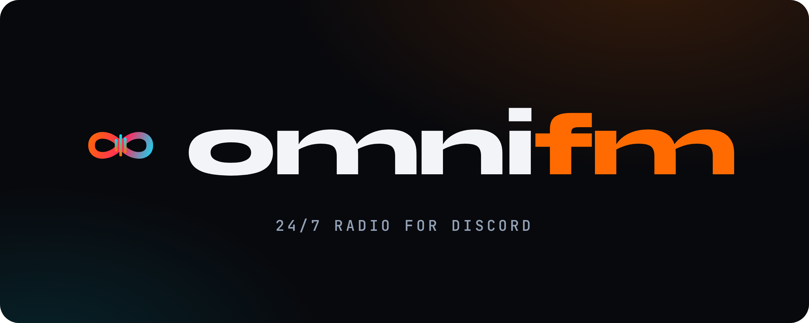

# OmniFM

**OmniFM** ist eine moderne, professionelle 24/7 **Discord Radio- & Music-Plattform** – gehört wird direkt in Discord-Voice-Channels, verwaltet über ein hochwertiges Web-Dashboard.

<p align="center">
  
</p>

---

## ✨ Überblick

| Bereich | Beschreibung | Route |
|---|---|---|
| **Landing** | Marketing-Seite mit Live „Now Playing", Discord-Embed-Showcase, Sticky-Player | `/` |
| **Server-Dashboard** | Für Server-Admins (Discord OAuth): My Stations, Rollen & Rechte, Statistiken, Abo | `/dashboard` |
| **Owner-Konsole** | Passwortgeschützt (nur Betreiber) — **die komplette Konfigurationszentrale**: Unternehmen & Recht, Pläne & Preise, Discord & Bots, Zahlungen, Stationen, Monitoring, Lizenzen, Audit, Brand | `/admin` |
| **Brand-Kit** | Öffentliche Logo-/Presse-Seite mit Downloads & Sponsor-Badge-Einbettcode | `/brand` |

> **Sprache:** Die Website erkennt die Sprache automatisch am Browser (Deutsch/Englisch). Kein manueller Umschalter.

## 🧱 Architektur (dieser Stack)

```
┌────────────┐     /api/*      ┌──────────────┐        ┌───────────┐
│  React SPA │ ───────────────▶│  FastAPI     │ ─────▶ │  MongoDB  │
│ (frontend) │                 │  (backend)   │        └───────────┘
└────────────┘                 └──────────────┘
      :3000                          :8001
```

- **Frontend:** React (CRA), Design-System „Broadcast Studio" (Obsidian + Signal-Orange + Cyber-Cyan), `recharts`, `lucide-react`.
- **Backend:** FastAPI, alle Endpunkte unter `/api`, MongoDB über `MONGO_URL`.
- **Discord-Voice-Bot:** Node.js / `discord.js` (Commander/Worker-Split) – der eigentliche Streaming-Runtime unter `src/`. **Wird von `start.sh` mitgestartet und liest Commander + Worker vollständig aus dem Owner-Menü (MongoDB `owner_config.discord`) – keine Token-Env-Variablen nötig.** Teilt sich dieselbe MongoDB wie das Backend.

## 🎨 Marke

Ein einziges Vektor-Logo (Unendlichkeit + Schallwelle) in allen Varianten unter
`frontend/public/brand/` – SVG + transparente PNGs (hell/dunkel/mono), Wortmarken, Banner
(dunkel/hell/transparent), Discord-Avatar, Favicon und Sponsor-Badge. Siehe `/brand`.

- **Farben:** Obsidian `#08090d`, Surface `#0e111a`, Orange `#ff6b00`, Live-Rot `#ff2a5f`, Cyan `#00e5ff`
- **Fonts:** Syne (Display), DM Sans (Body), JetBrains Mono (Labels)

## 🚀 Schnellstart (lokal)

```bash
# Backend (FastAPI)
cd backend && pip install -r requirements.txt
uvicorn server:app --host 0.0.0.0 --port 8001

# Frontend (React)
cd frontend && npm ci && npm start
```

MongoDB muss erreichbar sein (siehe `.env`).

## 🖥️ Deployment auf Ubuntu 24.04 (kompletter Stack inkl. Discord-Bot)

**Keine manuellen Voraussetzungen mehr.** `start.sh` installiert beim ersten Lauf automatisch
alles Nötige: **Node.js 22 LTS, MongoDB 8.0 Community (lokal), FFmpeg, Python-venv und
Build-Tools**. Außerdem erzeugt es beim ersten Lauf automatisch `backend/.env` + `frontend/.env`.

Klonen → einmalig `./start.sh` → ab dann Updates per `./update.sh`:

```bash
git clone <repo> omnifm && cd omnifm
chmod +x start.sh stop.sh update.sh
sudo ./start.sh   # installiert ALLES, erzeugt .env, generiert Owner-Passwort, startet den Stack
./stop.sh         # alles stoppen  (./stop.sh --all stoppt auch MongoDB)
./update.sh       # git pull + Abhängigkeiten aktualisieren + Neustart (inkl. Bot)
./update.sh --doctor  # nur Voraussetzungen prüfen, nichts verändern
```

> `sudo` wird für die Systeminstallation benötigt (Node/MongoDB/FFmpeg). Läufst du bereits als
> `root`, reicht `./start.sh`. Setup-Logs landen unter `logs/setup.log`.

### 🔑 Owner-Passwort

Beim **allerersten** Start generiert `start.sh` als Erstes einen sicheren **Owner-Token**
(= Passwort für `/admin`), zeigt ihn oben und unten in der Ausgabe an und speichert ihn in
`backend/.env` (`API_ADMIN_TOKEN`). Bei jedem weiteren Lauf bleibt derselbe Token erhalten.
Zugang: Website unter Port 3000 → `/admin` → Token eingeben.

### 🌐 Betrieb hinter einem Reverse-Proxy (eigene Domain, z.B. omnifm.xyz)

OmniFM ist standardmäßig **reverse-proxy-fertig**: Das Frontend ruft die API **relativ
auf derselben Domain** auf (`/api/...`). Dadurch gibt es **kein Mixed-Content, kein CORS
und keinen domainspezifischen Rebuild**. Es sind nur zwei Dinge nötig:

**1. Der Proxy MUSS `/api/` ans Backend routen** (sonst kommt `{"detail":"Not Found"}`
oder HTML statt JSON und die Sender/Login gehen nicht):
- `/`      → OmniFM-Frontend `:3000`
- `/api/`  → OmniFM-Backend  `:8001`

Fertige nginx-Config liegt bei: `deploy/nginx/omnifm.conf` (auf dem Proxy-Server
installieren; Ziel-IP des OmniFM-Servers dort eintragen). Danach `nginx -t && systemctl reload nginx`.

**2. Frontend bauen** – einfach `./start.sh` bzw. `./update.sh` (nutzt automatisch die
relative Same-Origin-API). Fertig.

> Sonderfälle:
> - `PUBLIC_URL=https://omnifm.xyz ./start.sh` – erzwingt die absolute Domain (auch Same-Origin).
> - `DIRECT_IP=1 ./start.sh` – direkter Website-Zugriff ohne Proxy über `http://<server-ip>:3000`; die SPA nutzt dabei die API auf `:8001`.

Owner-Login danach: Domain → `/admin` → Owner-Token (aus `backend/.env`, wird beim ersten
`start.sh` erzeugt und angezeigt).

`start.sh` ist idempotent: es installiert Systempakete nur, wenn sie fehlen, erstellt bei Bedarf
ein Python-venv, installiert Backend-, Frontend- und Bot-Abhängigkeiten, baut das Frontend,
serviert es und startet den Discord-Bot **aus der Owner-Config**. Ist noch kein Commander-Token
im Owner-Menü hinterlegt, wird der Bot sauber übersprungen (der Rest läuft trotzdem). Logs unter
`logs/`, PIDs unter `run/`. Ports via `BACKEND_PORT` / `FRONTEND_PORT` überschreibbar, öffentliche
URL via `PUBLIC_URL=https://domain.tld ./start.sh`.

Bei Updates bleiben `backend/.env`, `frontend/.env` und alle MongoDB-Daten unverändert. Vor jedem
Pull legt `update.sh` zusätzlich eine lokale Sicherung der Env-Dateien unter `.update-backups/` an.
Abhängigkeiten, Frontend-Build, FastAPI/MongoDB und die DB-gesteuerte Bot-Konfiguration werden vor
dem Stoppen der laufenden Version geprüft. Frontend und Backend wechseln danach gemeinsam auf den
neuen Git-Stand.

### Discord-Bot einrichten (100 % über die Owner-Konsole)

1. `./start.sh` starten → Website + Owner-Konsole laufen.
2. `/admin` → **Discord & Bots**: Commander-Token + Client-ID eintragen, beliebig viele Worker
   („+ Bot hinzufügen") mit Token/Client-ID/Tier anlegen. Speichern.
3. `./update.sh` (oder `./start.sh`) erneut ausführen → der Bot bootet automatisch mit genau diesen
   Bots. Commander nimmt Slash-Commands entgegen und verteilt Voice-Streams an die Worker.

> Der Bot liest **ausschließlich** aus der MongoDB-Owner-Config (`src/entrypoints/from-owner-config.mjs`).
> Änderungen an Bots/Tokens erfordern nur ein erneutes `./update.sh` – keine Datei- oder Env-Bearbeitung.

## ⚙️ Konfiguration

**`backend/.env`**
```
MONGO_URL=mongodb://localhost:27017
DB_NAME=omnifm
API_ADMIN_TOKEN=<geheimer-owner-token>      # Zugang zur Owner-Konsole /admin
CORS_ALLOWED_ORIGINS=http://localhost:3000,http://127.0.0.1:3000
```

**`frontend/.env`**
```
REACT_APP_BACKEND_URL=https://deine-domain.tld
```

Bestehende `STRIPE_*`, Discord-OAuth-, SMTP-, Song-Erkennungs- und Bot-Verzeichnis-Werte werden
beim ersten Speichern sicher in die Owner-Konfiguration übernommen; laufende Installationen
verlieren bei einem Update keine Secrets.

## 🔑 Owner-Konsole — die zentrale Konfigurationsoberfläche

`/admin` → mit `API_ADMIN_TOKEN` anmelden. **Alles wird in MongoDB gespeichert und
überschreibt die `.env`-Defaults** — die komplette Plattform ist über die UI konfigurierbar:

- **Unternehmen & Recht** — Firma, Adresse, UID, Kleinunternehmer-Status (Österreich) →
  generiert **Impressum, Datenschutz & Nutzungsbedingungen automatisch**.
- **Pläne & Preise** — Free/Pro/Ultimate: EUR-Preise, Bot-Anzahl, Stationen, Audio, Features →
  wirkt sofort auf die Preis-Sektion der Website.
- **Discord & Bots** — Commander-Token/Client-ID, Worker-Bots (**„+ Bot hinzufügen“**), Invite-Links, Bot-Logs.
- **System-Konfiguration** — Discord OAuth, SMTP, Song-Erkennung, Song-Verlauf sowie Discord Bot
  List, Bots.gg und Top.gg; inklusive zentralem Konfigurations-/Verbindungstest.
- **Zahlungen** — Stripe Checkout + signierter Webhook (Secrets maskiert); PayPal ist als spätere
  Integration vorbereitet und in der Oberfläche eindeutig als noch nicht live markiert.
- **Global Overview** (Lizenzen, MRR/ARR, Server, Stationen), **Live-Monitoring** (Worker-Health, Incidents, Logs).
- **Radio-Katalog** verwalten inkl. **Stream-Test**, **Lizenz-Manager**, **Audit-Log**, **Brand-Kit**.

## 📡 Wichtige API-Endpunkte

```
GET  /api/health
GET  /api/stats | /api/stations | /api/bots | /api/commands
GET  /api/legal | /api/privacy | /api/terms      # aus Owner-Config generiert
GET  /api/premium/tiers | /api/premium/pricing    # aus Owner-Config (Pläne)
GET  /api/cover?term=                             # keyless Cover-Art (iTunes)
# Owner (Header: X-Admin-Token)
POST /api/admin/login
GET  /api/admin/overview | /workers | /licenses | /stations | /monitoring | /audit | /integrations
GET/PUT /api/admin/config            # company, plans, discord, system, payments, marketing
POST /api/admin/integrations/test
GET  /api/admin/discord/logs
POST /api/admin/licenses   PATCH/DELETE /api/admin/licenses/{license_key}
POST /api/admin/stations   DELETE /api/admin/stations/{key}   POST /api/admin/stations/test
POST /api/admin/stations/health
POST /api/premium/webhook             # Stripe checkout.session.completed
# Server-Dashboard (Discord OAuth Session)
GET  /api/auth/session   GET/PUT /api/dashboard/perms   GET/POST/DELETE /api/dashboard/custom-stations
```

## 📄 Lizenz

Proprietär – © OmniFM. Alle Rechte vorbehalten.
