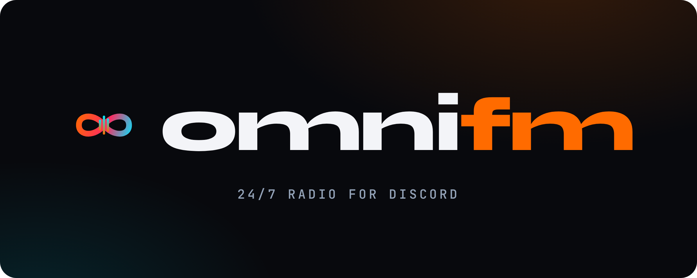

# OmniFM

**OmniFM** ist eine moderne, professionelle 24/7 **Discord Radio- & Music-Plattform** – gehört wird direkt in Discord-Voice-Channels, verwaltet über ein hochwertiges Web-Dashboard.

<p align="center">
  
</p>

---

## ✨ Überblick

| Bereich | Beschreibung | Route |
|---|---|---|
| **Landing** | Marketing-Seite mit Live „Now Playing", Discord-Embed-Showcase, Sticky-Player | `/` |
| **Server-Dashboard** | Für Server-Admins (Discord OAuth): My Stations, Rollen & Rechte, Statistiken, Abo | `/dashboard` |
| **Owner-Konsole** | Passwortgeschützt (nur Betreiber) — **die komplette Konfigurationszentrale**: Unternehmen & Recht, Pläne & Preise, Discord & Bots, Stationen, Monitoring, Lizenzen, Audit, Brand | `/admin` |
| **Brand-Kit** | Öffentliche Logo-/Presse-Seite mit Downloads & Sponsor-Badge-Einbettcode | `/brand` |

> **Sprache:** Website, Dashboard und Bot sprechen neun Sprachen: Deutsch, Englisch, Französisch, Spanisch, Italienisch, Polnisch, Türkisch, Portugiesisch und Niederländisch. Die Website nimmt die Sprache des Browsers; `?lang=fr` im Link legt sie fest.

## 🧱 Architektur (dieser Stack)

```
┌────────────┐     /api/*      ┌──────────────┐        ┌───────────┐
│  React SPA │ ───────────────▶│  Node-API    │ ─────▶ │  MongoDB  │
│ (frontend) │                 │  (api.js)    │        └───────────┘
└────────────┘                 └──────┬───────┘              ▲
      :3000                          :8001                   │
                        Dashboard,    │  127.0.0.1:8002      │
                        Login, Cockpit▼                      │
                               ┌──────────────┐              │
                               │ Commander +  │ ─────────────┘
                               │ Worker (Bot) │
                               └──────────────┘
```

- **Frontend:** React + Vite, Design-System „Broadcast Studio" (Obsidian + Signal-Orange + Cyber-Cyan), `recharts`, `lucide-react`.
- **Backend:** Die Node-API (`src/entrypoints/api.js`, Dienst `omnifm-backend`) ist der öffentliche Eingang für `/api` (Port 8001), MongoDB über `MONGO_URL`. Owner-Konsole (`/api/admin/*`), Website-Daten, Premium und Webhooks beantwortet sie selbst; Dashboard, Discord-Login, Share-Karten und Cockpit gibt sie an die Node-API im Commander (127.0.0.1:8002) weiter. Rückweg auf den bisherigen FastAPI-Dienst: `OMNIFM_PUBLIC_BACKEND=fastapi` in `backend/.env`, dann `./update.sh`.
- **Dashboard-API (Entscheidung #195, 2026-09-24):** `/api/auth/*` und `/api/dashboard/*` beantwortet die Node-API im Commander-Prozess (nur `127.0.0.1:8002`); der öffentliche Eingang leitet sie weiter. So gelten für Failover-Kette, Voice Guard, Alerts, Exporte und Digest dieselben Module wie im Bot. `scripts/check-api-routes.mjs` prüft, dass jede `/api`-Route des Frontends im zuständigen Backend existiert.
- **Discord-Voice-Bot:** Node.js / `discord.js` (Commander/Worker-Split) – der eigentliche Streaming-Runtime unter `src/`. **Wird von `start.sh` mitgestartet und liest Commander + Worker vollständig aus dem Owner-Menü (MongoDB `owner_config.discord`) – keine Token-Env-Variablen nötig.** Teilt sich dieselbe MongoDB wie das Backend.

## 🎨 Marke

Ein einziges Vektor-Logo (Unendlichkeit + Schallwelle) in allen Varianten unter
`frontend/public/brand/` – SVG + transparente PNGs (hell/dunkel/mono), Wortmarken, Banner
(dunkel/hell/transparent), Discord-Avatar, Favicon und Sponsor-Badge. Siehe `/brand`.

- **Farben:** Obsidian `#08090d`, Surface `#0e111a`, Orange `#ff6b00`, Live-Rot `#ff2a5f`, Cyan `#00e5ff`
- **Fonts:** Syne (Display), DM Sans (Body), JetBrains Mono (Labels)

## 🚀 Schnellstart (lokal)

```bash
# Backend (öffentliche Node-API; Dashboard und Login brauchen zusätzlich den Bot)
npm ci
node src/entrypoints/api.js --port 8001

# Frontend (React)
cd frontend && npm ci && npm start
```

MongoDB muss erreichbar sein (siehe `.env`).

## 🖥️ Deployment auf Ubuntu 24.04 (kompletter Stack inkl. Discord-Bot)

**Keine manuellen Voraussetzungen mehr.** `start.sh` installiert beim ersten Lauf automatisch
alles Nötige: **Node.js 22 LTS (mindestens 22.12), MongoDB 8.0 Community (lokal), FFmpeg, Python-venv und
Build-Tools**. Außerdem erzeugt es beim ersten Lauf automatisch `backend/.env` + `frontend/.env`.

Klonen → einmalig `./start.sh` → ab dann Updates per `./update.sh`:

```bash
git clone <repo> omnifm && cd omnifm
chmod +x start.sh stop.sh update.sh
sudo ./start.sh   # installiert ALLES, erzeugt .env, generiert Owner-Passwort, startet den Stack
./stop.sh         # alles stoppen  (./stop.sh --all stoppt auch MongoDB)
./update.sh       # git pull + Abhängigkeiten aktualisieren + Neustart (inkl. Bot)
./update.sh --doctor  # nur Voraussetzungen prüfen, nichts verändern
```

> `sudo` wird für die Systeminstallation benötigt (Node/MongoDB/FFmpeg). Läufst du bereits als
> `root`, reicht `./start.sh`. Setup-Logs landen unter `logs/setup.log`.

### 🔑 Owner-Passwort

Beim **allerersten** Start generiert `start.sh` als Erstes einen sicheren **Owner-Token**
(= Passwort für `/admin`), zeigt ihn oben und unten in der Ausgabe an und speichert ihn in
`backend/.env` (`API_ADMIN_TOKEN`). Bei jedem weiteren Lauf bleibt derselbe Token erhalten.
Zugang: Website unter Port 3000 → `/admin` → Token eingeben.

### 🌐 Betrieb hinter einem Reverse-Proxy (eigene Domain, z.B. omnifm.xyz)

OmniFM ist standardmäßig **reverse-proxy-fertig**: Das Frontend ruft die API **relativ
auf derselben Domain** auf (`/api/...`). Dadurch gibt es **kein Mixed-Content, kein CORS
und keinen domainspezifischen Rebuild**. Es sind nur zwei Dinge nötig:

**1. Der Proxy MUSS `/api/` ans Backend routen** (sonst kommt `{"detail":"Not Found"}`
oder HTML statt JSON und die Sender/Login gehen nicht):
- `/`      → OmniFM-Frontend `:3000`
- `/api/`  → OmniFM-Backend  `:8001`

Fertige nginx-Config liegt bei: `deploy/nginx/omnifm.conf` (auf dem Proxy-Server
installieren; Ziel-IP des OmniFM-Servers dort eintragen). Danach `nginx -t && systemctl reload nginx`.

**2. Frontend bauen** – einfach `./start.sh` bzw. `./update.sh` (nutzt automatisch die
relative Same-Origin-API). Fertig.

**3. Dem Proxy vertrauen** (#484): Hinter dem Proxy kommt jede Anfrage von dessen Adresse.
Ohne die zwei Zeilen unten sieht die API nur den Proxy, und **alle Besucher teilen sich ein
Limit von 60 Anfragen pro Minute**: Bei etwas Andrang bleiben Senderliste und Preise leer.
In `backend/.env` eintragen, dann `./update.sh`:
```bash
TRUST_PROXY_HEADERS=1
TRUSTED_PROXY_IPS=192.168.2.100   # die Adresse des Proxys; nginx auf demselben Rechner: 127.0.0.1,::1
```
Fehlt das, zeigt das Owner-Cockpit unter „Besucher-Adressen“ eine gelbe Ampel mit genau diesen Zeilen.

**4. Live-Verbindung des Dashboards** (#502): Pro offenem Tab hält das Dashboard eine Verbindung
offen, über die der Server Änderungen schickt (Server-Sent Events, `/api/dashboard/live`).
nginx reicht sie dank `X-Accel-Buffering: no` sofort weiter; `deploy/nginx/omnifm.conf` braucht
nichts Zusätzliches. Ein anderer Proxy darf diese Antworten nicht puffern und eine Verbindung
nicht nach weniger als 30 Sekunden Stille schließen (der Server schickt alle 25 Sekunden ein
Lebenszeichen). Klappt das nicht, fragt das Dashboard von selbst alle 30 Sekunden.

> Sonderfälle:
> - `PUBLIC_URL=https://omnifm.xyz ./start.sh` – erzwingt die absolute Domain (auch Same-Origin).
> - `DIRECT_IP=1 ./start.sh` – direkter Website-Zugriff ohne Proxy über `http://<server-ip>:3000`; die SPA nutzt dabei die API auf `:8001`.

Owner-Login danach: Domain → `/admin` → Owner-Token (aus `backend/.env`, wird beim ersten
`start.sh` erzeugt und angezeigt).

`start.sh` ist idempotent: es installiert Systempakete nur, wenn sie fehlen, erstellt bei Bedarf
ein Python-venv, installiert Backend-, Frontend- und Bot-Abhängigkeiten, baut das Frontend,
serviert es und startet den Discord-Bot **aus der Owner-Config**. Ist noch kein Commander-Token
im Owner-Menü hinterlegt, wird der Bot sauber übersprungen (der Rest läuft trotzdem).

Auf Servern mit systemd laufen die drei Teile als eigene Dienste `omnifm-backend`, `omnifm-frontend`
und `omnifm-bot` (`Restart=always`, Autostart nach dem Reboot, `start.sh` wartet vorher bis zu 60 s auf
MongoDB). Die Vorlagen liegen unter `deploy/systemd/`. Status und Logs:

```bash
systemctl status omnifm-backend omnifm-frontend omnifm-bot
journalctl -u omnifm-bot -n 100 -f
./update.sh --status quick          # Dienste, MongoDB, API-Health, Speicherplatz
./update.sh --status local-logs     # letzte Zeilen aus logs/
./update.sh --show-bots             # Commander/Worker aus dem Owner-Menü (ohne Tokens)
./update.sh --cleanup dry-run       # rotierte Logs älter als 14 Tage (run löscht sie)
```

Dateilogs liegen weiterhin unter `logs/` (`backend.log`, `frontend.log`, `bot.log`, `bot-console.log`).
Ohne systemd (WSL, Container) startet `start.sh` die Prozesse wie bisher per `nohup` mit PIDs unter
`run/`. Ports via `BACKEND_PORT` / `FRONTEND_PORT` überschreibbar, öffentliche
URL via `PUBLIC_URL=https://domain.tld ./start.sh`.

Bei Updates bleiben `backend/.env`, `frontend/.env` und alle MongoDB-Daten unverändert. Vor jedem
Pull legt `update.sh` zusätzlich Sicherungen der Env-Dateien, der dateibasierten Runtime-Daten und
der vollständigen OmniFM-MongoDB unter `.update-backups/` an. Kann der Mongo-Snapshot nicht erstellt
und als komprimiertes Archiv geprüft werden, bricht das Update vor dem Pull ab und die laufende
Version bleibt unangetastet. Backups werden nie automatisch gelöscht.
Von älteren Deployments automatisch veränderte `package-lock.json`-Dateien werden dort als Patch
gesichert und auf den letzten Git-Stand zurückgeführt, damit sie den Fast-Forward-Pull nicht blockieren.
Andere lokale Quellcodeänderungen bleiben unangetastet und stoppen das Update mit einer klaren Meldung.
Abhängigkeiten, Frontend-Build, FastAPI/MongoDB und die DB-gesteuerte Bot-Konfiguration werden vor
dem Stoppen der laufenden Version geprüft. Frontend und Backend wechseln danach gemeinsam auf den
neuen Git-Stand.

Mongo-Backups können unabhängig vom Update geprüft und – nur bei gestopptem OmniFM, mit ausdrücklichem
`--force` und einem zusätzlichen Sicherheits-Snapshot des aktuellen Stands – wiederhergestellt werden:

```bash
bash ./scripts/backup-mongodb.sh list
bash ./scripts/backup-mongodb.sh verify .update-backups/mongodb/<backup>.archive.gz
./stop.sh
bash ./scripts/backup-mongodb.sh restore .update-backups/mongodb/<backup>.archive.gz --force
./start.sh
```

### Discord-Bot einrichten (100 % über die Owner-Konsole)

1. `./start.sh` starten → Website + Owner-Konsole laufen.
2. `/admin` → **Discord & Bots**: Commander-Token + Client-ID eintragen, beliebig viele Worker
   („+ Bot hinzufügen") mit Token/Client-ID/Tier anlegen. Speichern.
3. `./update.sh` (oder `./start.sh`) erneut ausführen → der Bot bootet automatisch mit genau diesen
   Bots. Commander und jeder Worker laufen als getrennte, automatisch überwachte Node.js-Prozesse.
   Commander nimmt Slash-Commands entgegen und verteilt Voice-Streams über MongoDB an die Worker.

> Der Bot liest **ausschließlich** aus der MongoDB-Owner-Config (`src/entrypoints/from-owner-config.mjs`).
> Änderungen an Bots/Tokens erfordern nur ein erneutes `./update.sh` – keine Datei- oder Env-Bearbeitung.
> Für eine gezielte Legacy-Diagnose kann `OMNIFM_DEPLOYMENT_MODE=monolith` gesetzt werden; Produktion
> verwendet bei mehreren konfigurierten Bots automatisch den echten Prozess-Split.

## ⚙️ Konfiguration

**`backend/.env`**
```
MONGO_URL=mongodb://localhost:27017
DB_NAME=omnifm
API_ADMIN_TOKEN=<geheimer-owner-token>      # Zugang zur Owner-Konsole /admin
CORS_ALLOWED_ORIGINS=http://localhost:3000,http://127.0.0.1:3000
```

**`frontend/.env`**
```
REACT_APP_BACKEND_URL=https://deine-domain.tld
```

Bestehende Discord-OAuth-, SMTP-, Song-Erkennungs- und Bot-Verzeichnis-Werte werden
beim ersten Speichern sicher in die Owner-Konfiguration übernommen; laufende Installationen
verlieren bei einem Update keine Secrets.

## 🔑 Owner-Konsole — die zentrale Konfigurationsoberfläche

`/admin` → mit `API_ADMIN_TOKEN` anmelden. **Alles wird in MongoDB gespeichert und
überschreibt die `.env`-Defaults** — die komplette Plattform ist über die UI konfigurierbar:

- **Unternehmen & Recht** — Firma, Adresse, UID, Kleinunternehmer-Status (Österreich) →
  generiert **Impressum, Datenschutz & Nutzungsbedingungen automatisch**.
- **Pläne & Preise** — Free/Pro/Ultimate: EUR-Preise, Bot-Anzahl, Stationen, Audio, Features →
  wirkt sofort auf die Preis-Sektion der Website.
- **Discord & Bots** — Commander-Token/Client-ID, Worker-Bots (**„+ Bot hinzufügen“**), Invite-Links, Bot-Logs.
- **System-Konfiguration** — Discord OAuth, SMTP, Song-Erkennung, Song-Verlauf sowie Discord Bot
  List, Bots.gg und Top.gg; inklusive zentralem Konfigurations-/Verbindungstest.
- **Premium** — Lizenzen und Gratis-Codes aus der Konsole, dazu der Testmonat. Auf der Website
  wird nichts mehr verkauft; Premium kommt direkt in Discord (#320).
- **Global Overview** (Lizenzen, MRR/ARR, Server, Stationen), **Live-Monitoring** (Worker-Health, Incidents, Logs).
- **Statusseite** — Störungen und Wartungen für omnifm.xyz/status; auf Wunsch kommen sie und gemessene
  Ausfälle als je ein Beitrag in einen Discord-Kanal, Änderungen bearbeiten denselben Beitrag (#478).
- **Radio-Katalog** verwalten inkl. **Stream-Test**, **Lizenz-Manager**, **Audit-Log**, **Brand-Kit**.

## 📡 Wichtige API-Endpunkte

```
GET  /api/health
GET  /api/stats | /api/stations | /api/bots | /api/commands
GET  /api/legal | /api/privacy | /api/terms      # aus Owner-Config generiert
GET  /api/premium/tiers | /api/premium/pricing    # aus Owner-Config (Pläne)
GET  /api/cover?term=                             # keyless Cover-Art (iTunes)
# Owner (Header: X-Admin-Token)
POST /api/admin/login
GET  /api/admin/overview | /workers | /licenses | /stations | /monitoring | /audit | /integrations
GET/PUT /api/admin/config            # company, plans, discord, system, marketing, access
POST /api/admin/integrations/test
GET  /api/admin/discord/logs
POST /api/admin/licenses   PATCH/DELETE /api/admin/licenses/{license_key}
POST /api/admin/stations   DELETE /api/admin/stations/{key}   POST /api/admin/stations/test
POST /api/admin/stations/health
# Server-Dashboard (Discord OAuth Session)
GET  /api/auth/session   GET/PUT /api/dashboard/perms   GET/POST/DELETE /api/dashboard/custom-stations
```

## 📄 Lizenz

Proprietär – © OmniFM. Alle Rechte vorbehalten.
